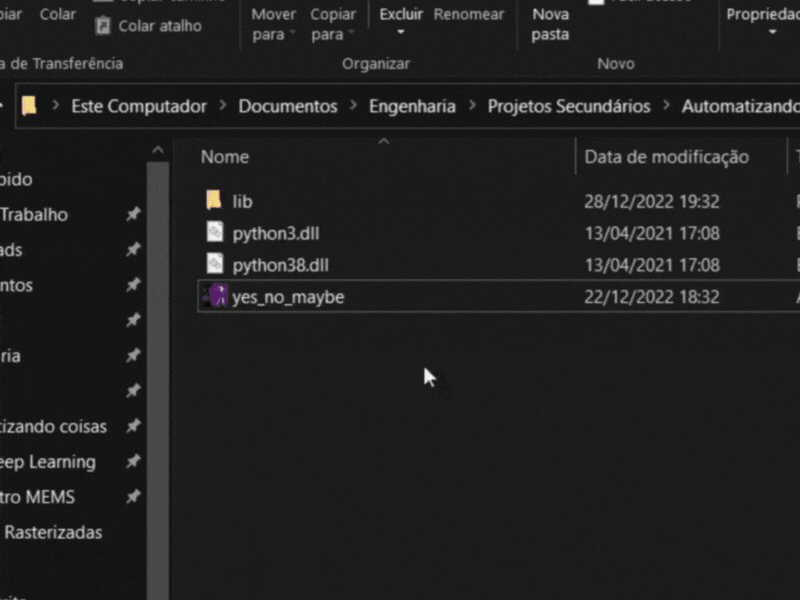

# yes_no_maybe
My first executable GUI project.

The code gives a random answer to the user questions. "Yes", "No" or "Maybe", simple as that. Most questions we have during our lives can be answered with one of these three words, right?

The user interface was made using the tkinter. The whole thing became an executable with cx_freeze.

